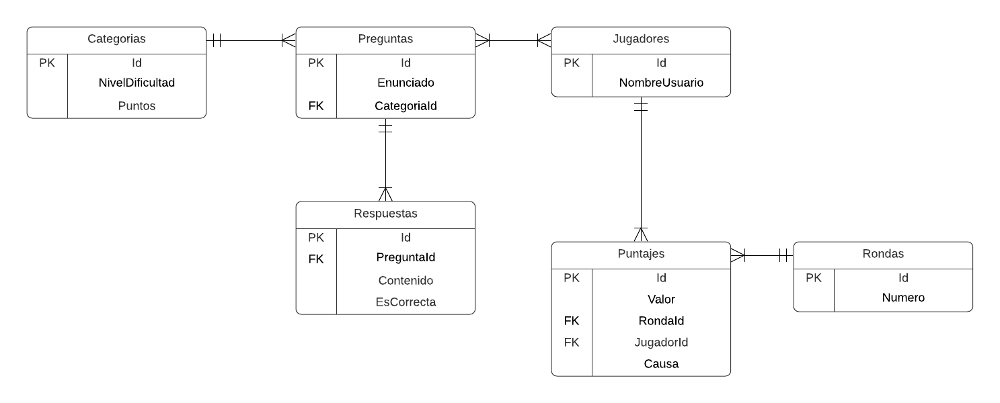

# Repositorio del Reto Sofka: Aplicación de preguntas y respuestas

## Prerrequisitos
Una vez clonado el repositorio debes tener instalado:
- Visual Studio 2019 en su versión 16.11.3 o superior y tener instalado el módulo "Desarrollo de escritorio de .NET".
- .NET 5

No requiere instalaciones adicionales ni configuración de bases de datos ya que la persistencia se maneja mediante un archivo de base de datos SQLite que se genera automáticamente la primera vez que se compila el proyecto. El archivo tiene como nombre **preguntas_respuestas.bd** y se almacena en la ruta relativa al proyecto **.\bin\Debug\net5.0-windows**

## Reto
>modelar un concurso de preguntas y respuestas, la intención es diseñar
una solución que permita tener un banco de preguntas con diferentes opciones para una única respuesta, además cada pregunta debe estar en una categoría o un grupo de preguntas similares del mismo nivel, por cada ronda se deberá asignar un premio a conseguir, las rondas del juego son nivel que van aumentando en la medida que el jugador gana premios. 
-**Tomado del documento otorgado por Sofka University**

### Solución del reto
1. Se leyó detenidamente el documento con toda la información, para identificar:
	- Problema planteado
	- Entidades
	- Funcionalidades

2. Creación de modelo entidad relación.
    
3. Elección de stack tecnológico. 

4. Desarrollo del proyecto.

### Tecnologías y herramientas utilizadas para el desarrollo
- .NET 5
- C#
- Visual Studio 2019
- Windows Forms
- Entity Framework Core
- DB Browser for SQLite
- POO

### Que hace la aplicación
Se trata de una aplicación de escritorio que permite al usuario jugar al clásico preguntas y respuestas, en este caso se tienen preguntas con 4 opciones de respuesta, pero solo una es la correcta.

**Condiciones iniciales:**
- 5 categorías: muy fácil, fácil, medio, difícil y muy difícil
- Cada categoría otorga una cantidad de puntos diferente
- 25 preguntas iniciales (5 por categoría) y cada una con sus 4 opciones de respuesta

**Juego:**
- Jugador inicia en la pantalla principal donde tiene opciones para:
	- Jugar: Esta opción permite al usuario ingresar su nombre o seleccionarlo si ya se ha registrado anteriormente, para luego pasar a iniciar el juego en la ronda 1 y con una pregunta de la categoría "muy fácil".

	- Configurar: Accediendo a esta opción podrá visualizar todas las preguntas existentes y podrá agregar nuevas preguntas si así lo desea, las preguntas tienen un enunciado y cuatro opciones de respuestas de las cuales debe indicar cual va a ser la opción correcta.

	- Puntuaciones: Podrá visualizar las puntuaciones alcanzadas por cada uno de los jugadores, además de la causa de su puntuación: Abandono, respondió incorrectamente o completo el juego

	- Salir: Cierra la aplicación.

- Una vez en juego se podrá finalizar la partida por 3 motivos:
	1. Completo el juego: Para cumplir esta condición el jugador deberá superar 5 rondas es decir responder 5 preguntas correctamente (recordemos que al ir pasando de ronda se aumenta la categoría de la pregunta).
	2. Abandono voluntario: El jugador decide que no quiere responder la pregunta de la ronda en la cual se encuentra por lo cual decide abandonar la partida en este caso se almacenara su puntuación hasta ese punto.
	3. Responder incorrectamente: El jugador elije y confirma una opción incorrecta por lo cual el juego le informara lo sucedido y almacenara su puntuación, pero poniendo que la causa fue "respondió incorrectamente"

### Anotaciones importantes
- Para la persistencia de datos se utiliza Entity Framework Core para generar a partir de código de C# una base de datos SQLite.

### Autor
**Antonio Alzate Naranjo**
¡Gracias por leer!

